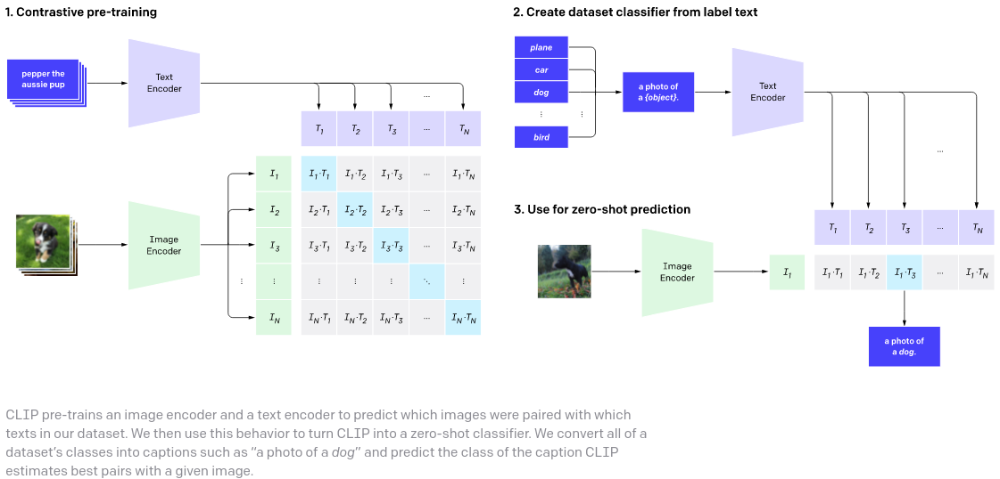

</img>

<a href="https://discord.gg/xBPBXfcFHd"></a>

## x-clip

A concise but complete implementation of <a href="https://openai.com/blog/clip/">CLIP</a> with various experimental improvements from recent papers

## Install

```bash
$ pip install x-clip
```

## Usage

```python
import torch
from x_clip import CLIP

clip = CLIP(
    dim_text = 512,
    dim_image = 512,
    dim_latent = 512,
    num_text_tokens = 10000,
    text_enc_depth = 6,
    text_seq_len = 256,
    text_heads = 8,
    visual_enc_depth = 6,
    visual_image_size = 256,
    visual_patch_size = 32,
    visual_heads = 8,
    visual_patch_dropout = 0.5,             # patch dropout probability, used in Kaiming He's FLIP to save compute and improve end results - 0.5 is good value, 0.75 on high end is tolerable
    use_all_token_embeds = False,           # whether to use fine-grained contrastive learning (FILIP)
    decoupled_contrastive_learning = True,  # use decoupled contrastive learning (DCL) objective function, removing positive pairs from the denominator of the InfoNCE loss (CLOOB + DCL)
    extra_latent_projection = True,         # whether to use separate projections for text-to-image vs image-to-text comparisons (CLOOB)
    use_visual_ssl = True,                  # whether to do self supervised learning on iages
    use_mlm = False,                        # use masked language learning (MLM) on text (DeCLIP)
    text_ssl_loss_weight = 0.05,            # weight for text MLM loss
    image_ssl_loss_weight = 0.05            # weight for image self-supervised learning loss
)

# mock data

text = torch.randint(0, 10000, (4, 256))
images = torch.randn(4, 3, 256, 256)

# train

loss = clip(
    text,
    images,
    freeze_image_encoder = False,   # whether to freeze image encoder if using a pretrained image net, proposed by LiT paper
    return_loss = True              # needs to be set to True to return contrastive loss
)

loss.backward()
```

You can also pass in an external visual transformer / residual net. You simply have to make sure your image encoder returns a set of embeddings in the shape of `batch x seq x dim`, and make sure `dim_image` is properly specified as the dimension of the returned embeddings. Below is an example using vision transformer from `vit_pytorch`

```bash
$ pip install vit_pytorch>=0.25.6
```

```python
import torch
from x_clip import CLIP

from vit_pytorch import ViT
from vit_pytorch.extractor import Extractor

base_vit = ViT(
    image_size = 256,
    patch_size = 32,
    num_classes = 1000,
    dim = 512,
    depth = 6,
    heads = 16,
    mlp_dim = 2048,
    dropout = 0.1,
    emb_dropout = 0.1
)

vit = Extractor(
    base_vit,
    return_embeddings_only = True
)

clip = CLIP(
    image_encoder = vit,
    dim_image = 512,           # must be set as the same dimensions as the vision transformer above
    dim_text = 512,
    dim_latent = 512,
    num_text_tokens = 10000,
    text_enc_depth = 6,
    text_seq_len = 256,
    text_heads = 8
)

text = torch.randint(0, 10000, (4, 256))
images = torch.randn(4, 3, 256, 256)

loss = clip(text, images, return_loss = True)
loss.backward()
```

Finally, one can also have the text transformer be externally defined. It will need to return the embeddings including the CLS token, for now.

```python
import torch
from x_clip import CLIP, TextTransformer

from vit_pytorch import ViT
from vit_pytorch.extractor import Extractor

base_vit = ViT(
    image_size = 256,
    patch_size = 32,
    num_classes = 1000,
    dim = 512,
    depth = 6,
    heads = 16,
    mlp_dim = 2048,
    dropout = 0.1,
    emb_dropout = 0.1
)

image_encoder = Extractor(
    base_vit,
    return_embeddings_only = True
)

text_encoder = TextTransformer(
    dim = 512,
    num_tokens = 10000,
    max_seq_len = 256,
    depth = 6,
    heads = 8
)

clip = CLIP(
    image_encoder = image_encoder,
    text_encoder = text_encoder,
    dim_image = 512,
    dim_text = 512,
    dim_latent = 512
)

text = torch.randint(0, 10000, (4, 256))
images = torch.randn(4, 3, 256, 256)

loss = clip(text, images, return_loss = True)
loss.backward()
```

## Multiview CL Losses

This repository also supports multiview contrastive learning loss, as proposed in <a href="https://arxiv.org/abs/2110.05208">DeCLIP</a>. Just pass in the augmented text and/or augmented image, and it will be auto-calculated, weighed by `multiview_loss_weight` set on initialization.

ex.

```python
import torch
from x_clip import CLIP, TextTransformer

from vit_pytorch import ViT
from vit_pytorch.extractor import Extractor

base_vit = ViT(
    image_size = 256,
    patch_size = 32,
    num_classes = 1000,
    dim = 512,
    depth = 6,
    heads = 16,
    mlp_dim = 2048,
    dropout = 0.1,
    emb_dropout = 0.1
)

image_encoder = Extractor(
    base_vit,
    return_embeddings_only = True
)

text_encoder = TextTransformer(
    dim = 512,
    num_tokens = 10000,
    max_seq_len = 256 + 1,
    depth = 6,
    heads = 8
)

clip = CLIP(
    image_encoder = image_encoder,
    text_encoder = text_encoder,
    dim_image = 512,
    dim_text = 512,
    dim_latent = 512,
    extra_latent_projection = True,
    multiview_loss_weight = 0.1         # weight multiview contrastive loss by 0.1
)

text = torch.randint(0, 10000, (4, 256))
images = torch.randn(4, 3, 256, 256)

aug_text = torch.randint(0, 10000, (4, 256))  # augmented text (backtranslation or EDA), same dimensions as text
aug_images = torch.randn(4, 3, 256, 256)      # augmented images, same dimension as images above
loss = clip(
    text,
    images,
    aug_text = aug_text,           # pass in augmented texts
    aug_image = aug_images,        # pass in augmented images
    return_loss = True,
    freeze_image_encoder = True
)

loss.backward()
```

You can even send in more than one augmented text or image

```python
# ...

aug_texts = (
    torch.randint(0, 10000, (4, 256)),
    torch.randint(0, 10000, (4, 256)),
)

aug_images = (
    torch.randn(4, 3, 256, 256),
    torch.randn(4, 3, 256, 256),
)

loss = clip(
    text,
    images,
    aug_text = aug_texts,
    aug_image = aug_images,
    return_loss = True,
    freeze_image_encoder = True
)

loss.backward()
```

## Custom Vision Self-supervised Learning Module

You can pass in your own vision self-supervised learning module through the `visual_ssl` keyword as so

```python
import torch
from x_clip import CLIP
from x_clip.visual_ssl import SimSiam

from vit_pytorch import ViT
from vit_pytorch.extractor import Extractor

base_vit = ViT(
    image_size = 256,
    patch_size = 32,
    num_classes = 1000,
    dim = 512,
    depth = 6,
    heads = 16,
    mlp_dim = 2048,
    dropout = 0.1,
    emb_dropout = 0.1
)

image_encoder = Extractor(
    base_vit,
    return_embeddings_only = True
)

visual_ssl = SimSiam(                 # SimSiam defined externally - needs to be a module that accepts an image of the same dimensions as CLIP and returns a scalar loss
    image_encoder,
    image_size = 256,
    hidden_layer = -1
)

clip = CLIP(
    image_encoder = image_encoder,
    dim_image = 512,
    dim_text = 512,
    dim_latent = 512,
    use_mlm = True,
    visual_ssl = visual_ssl,           # SSL module passed into CLIP
    use_all_token_embeds = False,
    extra_latent_projection = False,
    mlm_random_token_prob = 0.1
)

text = torch.randint(0, 10000, (4, 256))
images = torch.randn(4, 3, 256, 256)

loss = clip(text, images, return_loss = True)
loss.backward()

```

## Citations

```bibtex
@misc{radford2021learning,
    title   = {Learning Transferable Visual Models From Natural Language Supervision}, 
    author  = {Alec Radford and Jong Wook Kim and Chris Hallacy and Aditya Ramesh and Gabriel Goh and Sandhini Agarwal and Girish Sastry and Amanda Askell and Pamela Mishkin and Jack Clark and Gretchen Krueger and Ilya Sutskever},
    year    = {2021},
    eprint  = {2103.00020},
    archivePrefix = {arXiv},
    primaryClass = {cs.CV}
}
```

```bibtex
@misc{yao2021filip,
    title   = {FILIP: Fine-grained Interactive Language-Image Pre-Training}, 
    author  = {Lewei Yao and Runhui Huang and Lu Hou and Guansong Lu and Minzhe Niu and Hang Xu and Xiaodan Liang and Zhenguo Li and Xin Jiang and Chunjing Xu},
    year    = {2021},
    eprint  = {2111.07783},
    archivePrefix = {arXiv},
    primaryClass = {cs.CV}
}
```

```bibtex
@misc{fürst2021cloob,
    title   = {CLOOB: Modern Hopfield Networks with InfoLOOB Outperform CLIP},
    author  = {Andreas Fürst and Elisabeth Rumetshofer and Viet Tran and Hubert Ramsauer and Fei Tang and Johannes Lehner and David Kreil and Michael Kopp and Günter Klambauer and Angela Bitto-Nemling and Sepp Hochreiter},
    year    = {2021},
    eprint  = {2110.11316},
    archivePrefix = {arXiv},
    primaryClass = {cs.LG}
}
```

```bibtex
@misc{yeh2021decoupled,
    title   = {Decoupled Contrastive Learning},
    author  = {Chun-Hsiao Yeh and Cheng-Yao Hong and Yen-Chi Hsu and Tyng-Luh Liu and Yubei Chen and Yann LeCun},
    year    = {2021},
    eprint  = {2110.06848},
    archivePrefix = {arXiv},
    primaryClass = {cs.LG}
}
```

```bibtex
@misc{zhai2021lit,
    title   = {LiT: Zero-Shot Transfer with Locked-image Text Tuning},
    author  = {Xiaohua Zhai and Xiao Wang and Basil Mustafa and Andreas Steiner and Daniel Keysers and Alexander Kolesnikov and Lucas Beyer},
    year    = {2021},
    eprint  = {2111.07991},
    archivePrefix = {arXiv},
    primaryClass = {cs.CV}
}
```

```bibtex
@misc{li2021supervision,
    title   = {Supervision Exists Everywhere: A Data Efficient Contrastive Language-Image Pre-training Paradigm},
    author  = {Yangguang Li and Feng Liang and Lichen Zhao and Yufeng Cui and Wanli Ouyang and Jing Shao and Fengwei Yu and Junjie Yan},
    year    = {2021},
    eprint  = {2110.05208},
    archivePrefix = {arXiv},
    primaryClass = {cs.CV}
}
```

```bibtex
@Article{mu2021slip,
    author  = {Norman Mu and Alexander Kirillov and David Wagner and Saining Xie},
    title   = {SLIP: Self-supervision meets Language-Image Pre-training},
    journal = {arXiv preprint arXiv:2112.12750},
    year    = {2021},
}
```

```bibtex
@misc{su2021roformer,
    title   = {RoFormer: Enhanced Transformer with Rotary Position Embedding},
    author  = {Jianlin Su and Yu Lu and Shengfeng Pan and Bo Wen and Yunfeng Liu},
    year    = {2021},
    eprint  = {2104.09864},
    archivePrefix = {arXiv},
    primaryClass = {cs.CL}
}
```

```bibtex
@inproceedings{anonymous2022normformer,
    title   = {NormFormer: Improved Transformer Pretraining with Extra Normalization},
    author  = {Anonymous},
    booktitle = {Submitted to The Tenth International Conference on Learning Representations },
    year    = {2022},
    url     = {https://openreview.net/forum?id=GMYWzWztDx5},
    note    = {under review}
}
```

```bibtex
@inproceedings{Li2022ScalingLP,
    title   = {Scaling Language-Image Pre-training via Masking},
    author  = {Yanghao Li and Haoqi Fan and Ronghang Hu and Christoph Feichtenhofer and Kaiming He},
    year    = {2022}
}
```

```bibtex
@article{Liu2022PatchDropoutEV,
    title   = {PatchDropout: Economizing Vision Transformers Using Patch Dropout},
    author  = {Yue Liu and Christos Matsoukas and Fredrik Strand and Hossein Azizpour and Kevin Smith},
    journal = {ArXiv},
    year    = {2022},
    volume  = {abs/2208.07220}
}
```

```bibtex
@misc{shi2023enhance,
    title   = {Enhance audio generation controllability through representation similarity regularization}, 
    author  = {Yangyang Shi and Gael Le Lan and Varun Nagaraja and Zhaoheng Ni and Xinhao Mei and Ernie Chang and Forrest Iandola and Yang Liu and Vikas Chandra},
    year    = {2023},
    eprint  = {2309.08773},
    archivePrefix = {arXiv},
    primaryClass = {cs.SD}
}
```

